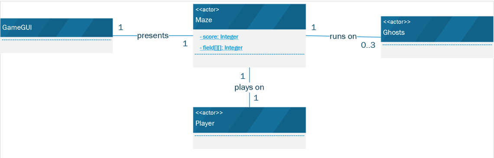
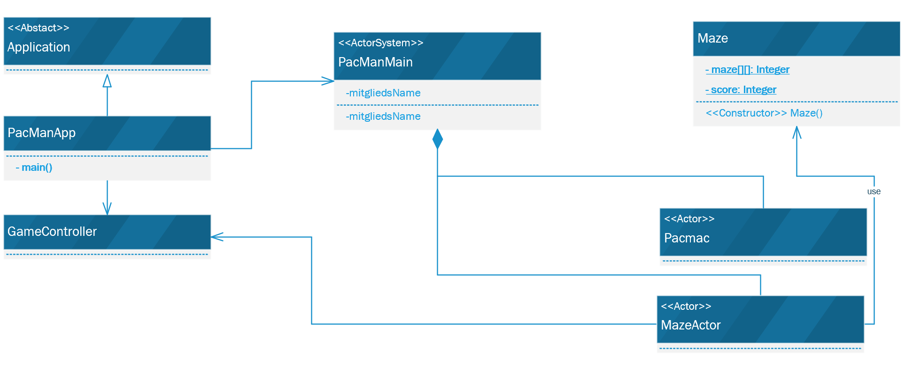
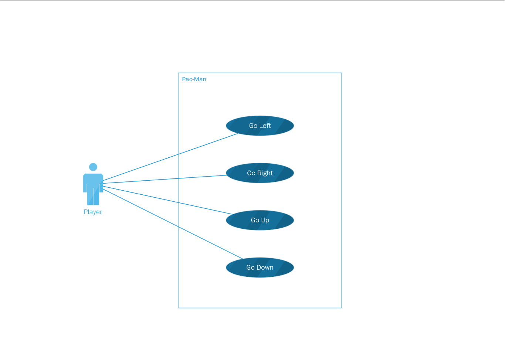
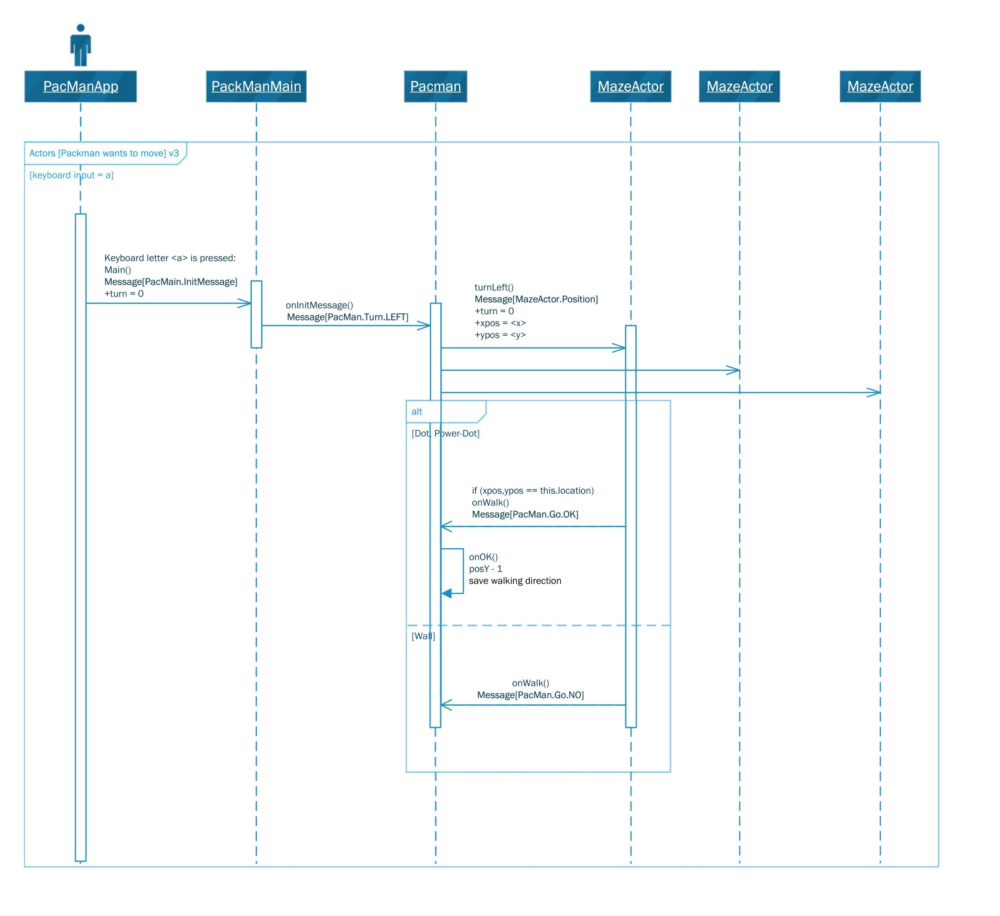
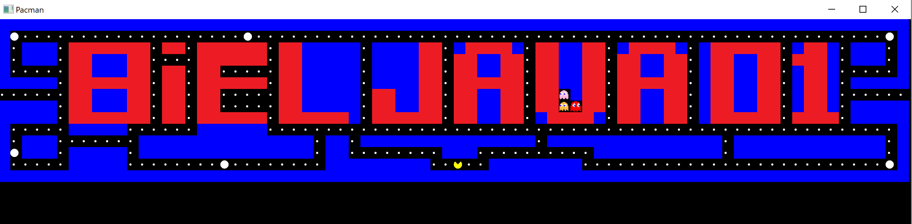

## Project PAC-MAN (Blockweek 2 20/21) Biel Java Group 01

The goal of the project is to develop a clone of the Pac-Man arcade game using the platform Akka.  The development of such game is not a small task especially with the 'Distance Learning' constraint even for a team of five developers.  However, the goal of this project is not only the programming concerns but also the software engineering aspects such as modeling, architecture, documentation.
This project has several interesting and not trivial problems to solve. Let us mention some of them:

* get familiar with the Akka platform in which every thing is an actor that sends messages (similar to asynchronous method call) to other actors;
* a challenge for this project is to represent by means of actors working concurrently all the elements involved in such application;
* the development of a model of this application will be essential;
* some strategies have to be developed for the ghosts behavior, ghost have to know, on some extent, the position of the player;
* the collisions between components is maybe also problematic in a concurrent environment;
* the interaction between the user and the player;
* finally the graphic user interface is difficult and demanding task.

For this project you must address the following points being creative:

* get familiar to the Akka platform;
* develop a domain model;
* develop some class diagrams that explain the static structure of your application;
* develop some sequence diagram that illustrate the dynamic aspects of your application;
* implement as much features of the application as possible.

---
## Component View

### Domain Model

## Project structure

### Java Class Diagram 

A light version to overview the stucture the Java Class.
Not all properties and function showing

### Use Case

## Dynamic View

### Sequence Diagram

## User interface
